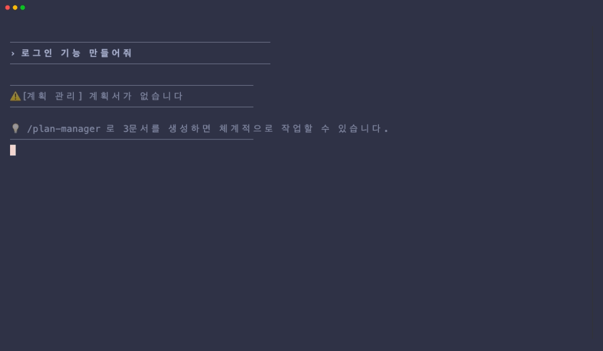
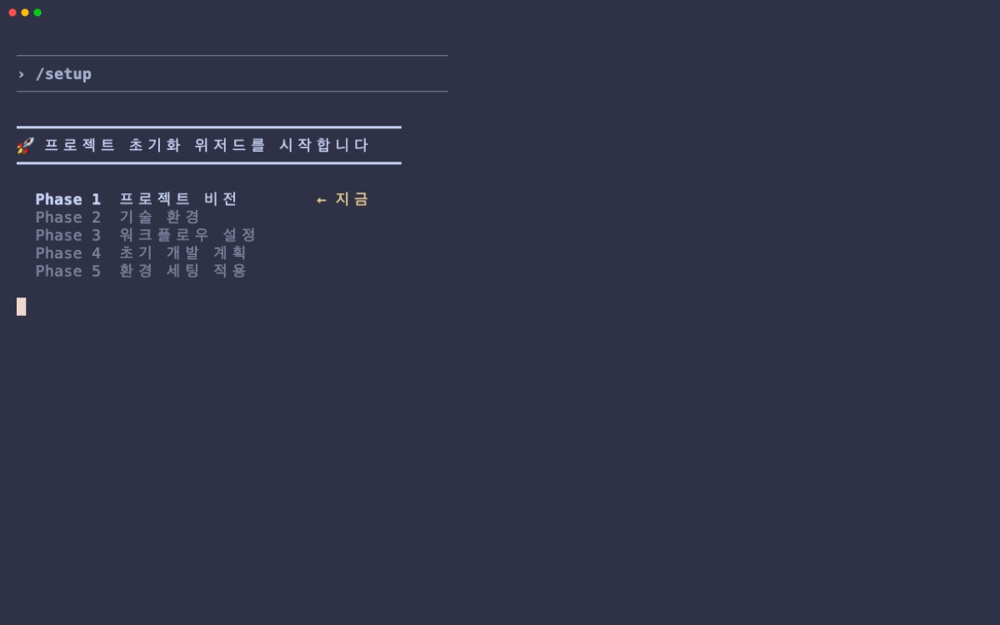
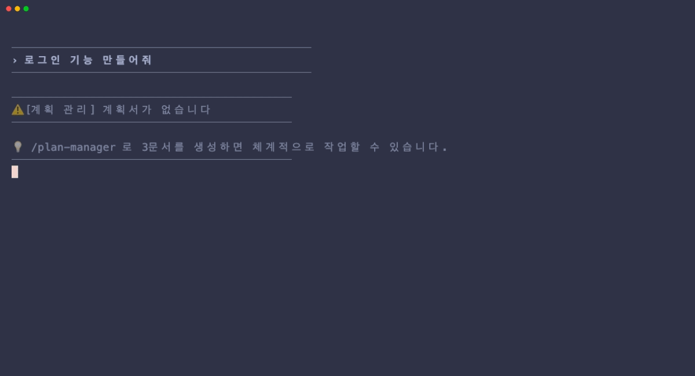
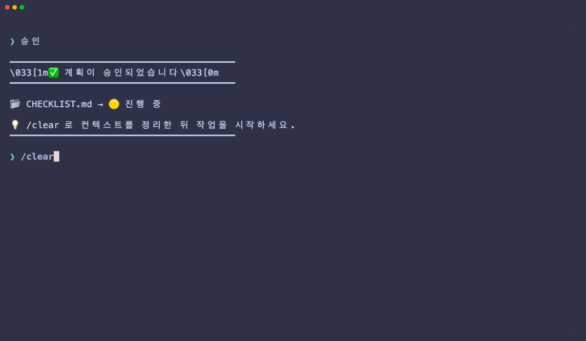
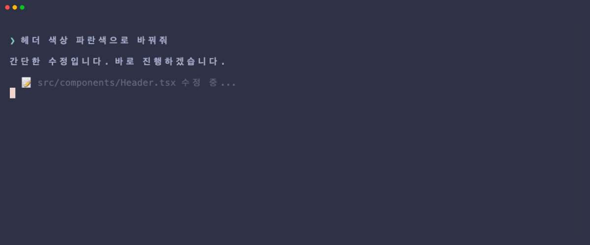

# Claude Code Dev System

Claude Code에서 **계획 → 승인 → 구현 → 품질 검사**를 자동으로 강제하는 개발 시스템 템플릿.

<p align="center">
  
</p>

---

## Claude Code에서 바로 시작하기

아래 명령어를 Claude Code에 그대로 붙여넣으세요:

```
https://github.com/HSUNEH/dev_sys_template 다운받아서 개발 환경 세팅해줘.
```

실행 후 `/exit`으로 Claude Code를 종료하고 다시 시작한 뒤, `/setup`을 입력하여 초기화 위저드를 실행하세요.

---

## 데모

### 1. /setup — 프로젝트 초기화

5단계 대화형 위저드로 프로젝트 정보 수집 → 환경 자동 세팅.



### 2. 계획 모드 — 체계적 개발

코드 변경 요청 시 자동으로 계획 수립을 유도합니다.



### 3. 승인 → /clear → 재개

계획 승인 후 컨텍스트를 정리하고, 자동으로 진행 상황을 복원합니다.



### 4. 간단 모드 — 빠른 수정

간단한 작업은 계획 없이 바로 진행. 품질 검사는 동일하게 작동합니다.



---

## 사용 흐름

### 1. 셋업

`/setup` → 5단계 대화형 위저드로 프로젝트 정보를 수집하고 환경을 자동 세팅합니다.

셋업이 완료되면 아래 두 가지 방식으로 작업합니다.

### 2. 일반 작업 (계획 → 승인 → 구현 루프)

코드 변경이 수반되는 작업은 이 흐름을 따릅니다.

```
사용자: "로그인 기능 만들어줘"
         │
         ▼
   ┌─ 계획 수립 ─────────────────────────┐
   │  /plan-manager 로 3문서 자동 생성    │
   │  ├── PLAN.md       구현 계획        │
   │  ├── CONTEXT.md    결정 근거        │
   │  └── CHECKLIST.md  작업 체크리스트   │
   └──────────────────────────────────────┘
         │
         ▼
   ⏸️ 사용자에게 계획 요약 → 승인 요청
         │
         ▼
   승인 → Phase 순서대로 구현 시작
         │
   ┌─ 매 코드 수정마다 자동 ─────────────┐
   │  • 변경 로그 기록                   │
   │  • 보안/에러 패턴 실시간 스캔        │
   │  • 체크리스트 업데이트 리마인더       │
   └──────────────────────────────────────┘
         │
         ▼
   응답 완료 시 린트/타입 자동 검사
   오류 4건 이상이면 서브에이전트 자동 투입
```

한 루프가 끝나면 다음 작업을 같은 방식으로 반복합니다.

### 3. 간단한 작업

버튼 색상 변경, 오타 수정 등 간단한 작업은 계획 없이 진행할 수 있습니다.

```
사용자: "헤더 색상 파란색으로 바꿔줘"
         │
         ▼
   시스템이 "간단한 작업입니다. 바로 진행할까요?" 확인
         │
         ▼
   사용자: "바로 해줘" → 계획 없이 바로 구현
         │
   ┌─ 자동 품질 검사는 동일하게 작동 ────┐
   │  • 변경 로그 기록                   │
   │  • 코드 패턴 스캔                   │
   │  • 린트/타입 검사                   │
   └──────────────────────────────────────┘
```

> 테스트 작성, 문서 수정 등은 확인 없이 바로 진행됩니다.

---

## 빠른 시작 (수동 설치)

```bash
# 1. 프로젝트 루트에 복사
cp -r dev-system-template/.claude  your-project/.claude/
cp -r dev-system-template/docs     your-project/docs/

# 2. 실행 권한 부여
chmod +x your-project/.claude/hooks/*.sh your-project/.claude/hooks/lib/*.sh

# 3. Claude Code 종료 후 재시작 (스킬 인식을 위해 필수)
/exit

# 4. 재시작 후 /setup 실행
```

> **주의:** 설치 후 반드시 `/exit`으로 Claude Code를 종료하고 다시 시작해야 합니다. 재시작해야 `/setup` 등 스킬이 인식됩니다.

`/setup`을 실행하면 5단계 대화형 위저드가 프로젝트 정보를 수집하고 환경을 자동 세팅합니다.

---

## `/setup` 위저드

| 단계 | 내용 | 산출물 |
|------|------|--------|
| Phase 1 | 프로젝트 비전 (이름, 설명, 핵심 기능) | - |
| Phase 2 | 기술 환경 (스택, 구조, 린터) | - |
| Phase 3 | 워크플로우 (코딩 규칙, 보안, 에이전트) | - |
| Phase 4 | 초기 개발 계획 수립 | `docs/plans/{기능}/` 3문서 |
| Phase 5 | 환경 세팅 자동 적용 | `CLAUDE.md`, `config.yml`, 매뉴얼 6개 |

각 Phase 사이에 사용자 확인을 받습니다. 기존 프로젝트면 `package.json` 등을 자동 분석합니다.

---

## 동작 원리

### 전체 흐름

```
사용자 지시 입력
    │
    ▼ ─── UserPromptSubmit ───────────────────────
    │
    │  plan-guard        계획 있는지 확인
    │  pre-prompt-check  매뉴얼 챕터 추천
    │
    ▼ ─── 작업 수행 (Edit/Write/Bash) ────────────
    │
    │  change-logger     변경 로그 자동 기록
    │  post-tool-check   보안/에러/위험 실시간 감지
    │  checklist-tracker 체크리스트 업데이트 리마인더
    │
    ▼ ─── Claude 응답 완료 ───────────────────────
    │
    │  completion-checker 린트/타입 자동 검사
    │    ├── 0건    → ✅ 통과
    │    ├── 1~3건  → ⚠️ 즉시 수정
    │    └── 4건+   → 🚨 서브에이전트 자동 위임
    │
    ▼ ─── SubagentStop ───────────────────────────
    │
    │  subagent-report-check  보고서 작성 확인
    ▼
```

### 계획 → 승인 → 구현 사이클

```
/plan-manager 실행
     │
     ▼
3문서 생성 (docs/plans/{작업명}/)
├── PLAN.md        뭘 만들 건지
├── CONTEXT.md     왜 이렇게 결정했는지
└── CHECKLIST.md   뭘 끝냈고 뭐가 남았는지 (🔴 시작 전)
     │
     ▼
⛔ 멈춤 — 사용자에게 계획 요약 보여주고 승인 요청
     │
     ▼
사용자 승인
     │
     ▼
CHECKLIST.md: 🔴 시작 전 → 🟡 진행 중
     │
     ▼
💡 /clear 권유 (계획 수립 컨텍스트 정리)
     │
     ▼
Phase 1부터 순서대로 구현 시작
```

**핵심 규칙:**
- 계획 승인 전에는 코드 작성 금지
- 같은 턴에 계획 수립과 구현을 동시에 하지 않음
- 세션이 끊겨도 `docs/plans/`에서 이어서 작업 가능

---

## 파일 구조

```
your-project/
├── .claude/
│   ├── settings.json                 Hook 등록 (수정 불필요)
│   ├── hooks/
│   │   ├── config.yml                ⭐ 중앙 설정 (커스터마이징 포인트)
│   │   ├── lib/
│   │   │   ├── config-parser.sh      YAML 파서
│   │   │   └── matcher.sh            매칭 엔진
│   │   ├── plan-guard.sh             계획 강제
│   │   ├── pre-prompt-check.sh       매뉴얼 추천
│   │   ├── change-logger.sh          변경 기록
│   │   ├── post-tool-check.sh        품질 셀프체크
│   │   ├── checklist-tracker.sh      체크리스트 리마인더
│   │   ├── completion-checker.sh     린트/타입 검사
│   │   └── subagent-report-check.sh  보고서 확인
│   ├── agents/
│   │   ├── qa-agent.md               코드 검토/수정 (sonnet)
│   │   ├── test-agent.md             테스트 작성/실행 (sonnet)
│   │   └── planning-agent.md         계획/문서 전용 (sonnet)
│   └── skills/
│       ├── setup/SKILL.md     /setup
│       ├── plan-manager/SKILL.md     /plan-manager
│       └── dev-manual/               /dev-manual
│           ├── SKILL.md
│           └── chapters/01~06        ⭐ 프로젝트 매뉴얼 (커스터마이징 포인트)
├── docs/
│   ├── plans/{작업명}/               계획 3문서
│   ├── logs/change-log.md            변경 로그 (자동)
│   └── reports/                      서브에이전트 보고서
└── CLAUDE.md                         프로젝트 설정 (/setup이 생성)
```

---

## 커스터마이징

수정할 파일은 **2곳**뿐입니다.

### 1. `config.yml` — Hook 동작 규칙

```yaml
# 키워드 추가
keywords:
  dev: "만들|개발|수정|추가|컴포넌트|네비게이션"

# 의도 추가
intents:
  migration:
    patterns: "마이그레이션|migration|스키마 변경"
    label: "DB 마이그레이션"
    chapters: "1,3"
    require_plan: true

# 경로 패턴 수정
locations:
  ui:
    patterns: "(screens?|features?)/.*\\.(tsx?|jsx?)"
    focus: "접근성, 상태 관리"

# 코드 패턴 추가
code_patterns:
  useeffect_cleanup:
    pattern: "useEffect\\("
    severity: "warning"
    message: "useEffect cleanup 함수 필요 여부 확인"

# 오류 임계값
completion_check:
  threshold_immediate_fix: 3
  threshold_agent_recommend: 4
```

### 2. `chapters/01~06` — 개발 매뉴얼

| 챕터 | 내용 |
|------|------|
| 01-project-overview | 프로젝트 개요, 기술 스택, 디렉토리 구조 |
| 02-coding-standards | 네이밍, 코드 스타일, 금지 패턴 |
| 03-architecture | 레이어 구조, 모듈, 의존성 방향 |
| 04-error-handling | 에러 처리 패턴, 로깅 |
| 05-security | 인증/인가, 보안 체크리스트 |
| 06-testing | 테스트 전략, 커버리지 기준 |

`/setup`이 프로젝트 정보 기반으로 자동 생성하므로 직접 작성할 필요는 없습니다.

---

## 매칭 엔진

모든 Hook은 4가지 조건으로 상황을 분석합니다.

| 조건 | 감지 대상 | 예시 |
|------|-----------|------|
| 키워드 | 프롬프트 단어 | "수정해줘" → dev |
| 의도 | 요청 패턴 | "새 API 만들어" → api → 챕터 2,3,4,5 |
| 위치 | 파일 경로 | `src/api/` → API 레이어 → 입력검증 중점 |
| 코드 패턴 | 파일 내용 | `eval()` → 보안 위험 경고 |

`config.yml`이 없거나 항목이 비어있으면 내장 기본값으로 폴백합니다.

---

## 스킬 목록

| 명령어 | 설명 |
|--------|------|
| `/setup` | 프로젝트 초기화 5단계 위저드 |
| `/plan-manager` | 개발 계획 3문서 생성 |
| `/dev-manual` | 작업 유형별 매뉴얼 챕터 읽기 |

---

## 서브에이전트

| 에이전트 | 역할 | 자동 투입 조건 | 산출물 |
|----------|------|---------------|--------|
| qa-agent | 코드 검토, 오류 수정 | 린트 오류 4건+ | `docs/reports/qa-report-{날짜}.md` |
| test-agent | 테스트 작성, 실행 | 테스트 필요 시 | `docs/reports/test-report-{날짜}.md` |
| planning-agent | 계획 수립, 문서 작성 | 계획 검토 필요 시 | `docs/reports/planning-report-{날짜}.md` |

모두 sonnet 모델을 사용하며, 반드시 보고서를 작성합니다.

---

## 세션 이어가기

세션이 끊겨도 `docs/plans/`에 모든 상태가 파일로 저장되어 있습니다.

```
새 세션 시작 → 아무 개발 지시
     │
     ▼
plan-guard.sh가 🟡 진행 중 자동 감지
     │
     ▼
┌──────────────────────────────────────┐
│ 📋 user-auth (🟡 진행 중)            │
│ 진행: 5/12 완료                      │
│ 현재: Phase 3 — NextAuth.js 설정     │
│ 남은 작업:                           │
│   · JWT 프로바이더                   │
│   · Google OAuth                    │
└──────────────────────────────────────┘
     │
     ▼
Claude가 PLAN.md, CHECKLIST.md 읽고 이어서 구현
```

---

## 상태 아이콘

| 상태 | 의미 |
|------|------|
| 🔴 시작 전 | 계획 미승인 — 코드 작성 금지 |
| 🟡 진행 중 | 승인됨 — 구현 진행 |
| 🟢 완료 | 작업 종료 |
